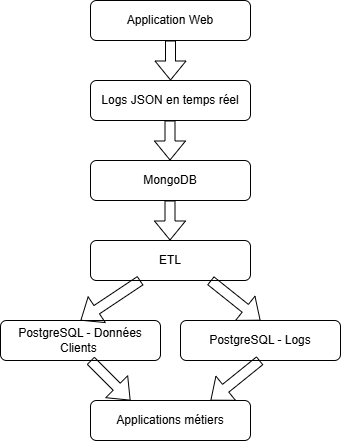

# TP2 - Cas pratique

### 1 - Ou vont les données

Les données reçues sont des logs utilisateurs envoyés en temps réel depuis l'applications web. Ces logs sont de format JSON et ils sont variables selon le type d’action (clic, page vue, etc.) et générés en grande quantité.

Pour gérer ces données, j'ai choisi la base de données MongoDB. Les schémas des données n'est pas figé ce qui est plus utils pour des logs variables. De plus on peu stocker les json directement sans pré-traitement. MongoDB est optimisé pour l'écriture rapide et en grande quantité. 

### 2 - Comment les exploiter

Une fois stockés dans MongoDB, les logs bruts doivent être nettoyés, structurés et analysés.
- Nettoyage : suppression des champs inutiles, normalisation
- Transformation : conversion en format tabulaire (colonnes → valeurs exploitables)
- Enrichissement : jointure avec la base clients SQL

Le but est de normaliser les logs pour pouvoir ensuite les exploiter dans des analyses et pour pouvoir les transformer en statistiques (afin d'améliorer les perfs de l'entreprise).

Pour cela, on peut utiliser Airflow. C'est un outils d'automatisation de cette parti du processus qu'on appel un ETL (Extract - Transform - Load). On peut aussi utiliser le langage de programmation python (pandas).

### 3 - Architecture
Voici l'architecture de ma base de données

### 4 - Performance et Sécurité

**Performance**

- Indexation MongoDB sur les champs critiques (timestamp, user_id)
- Suppression automatique des anciens logs (ex : après 90 jours)
- Archivage : déplacer les logs anciens dans du stockage froid
- Traitement asynchrone pour ne pas bloquer les flux

**Sécurité**
- Chiffrement au repos et en transit (TLS, chiffrement MongoDB et PostgreSQL)
- Contrôle des accès :
    - rôles spécifiques (lecture seule, admin, etc.)
    - séparation des droits : dev /prod / analyse
- Anonymisation ou pseudonymisation des données utilisateurs (RGPD)
- Audit des accès (logs d'accès, traçabilité)
- Conformité RGPD : droit à l’effacement, consentement

